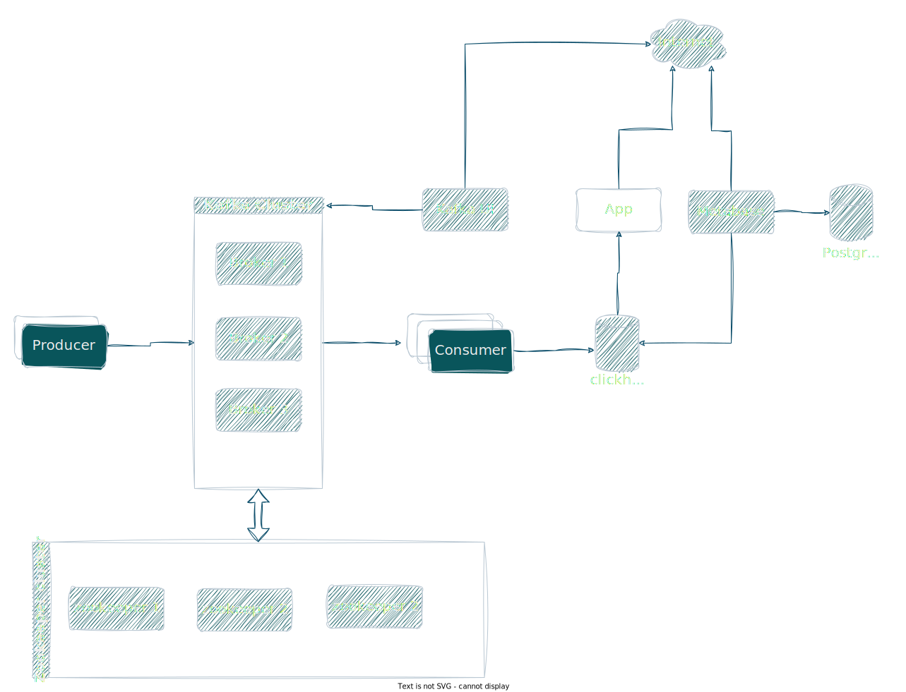
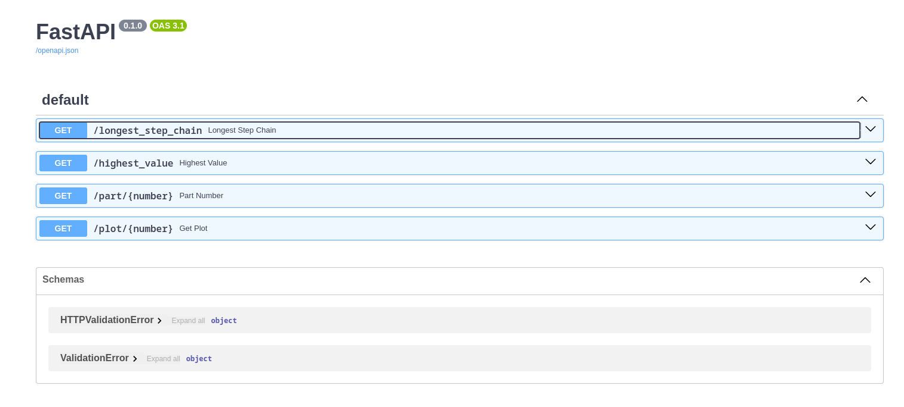
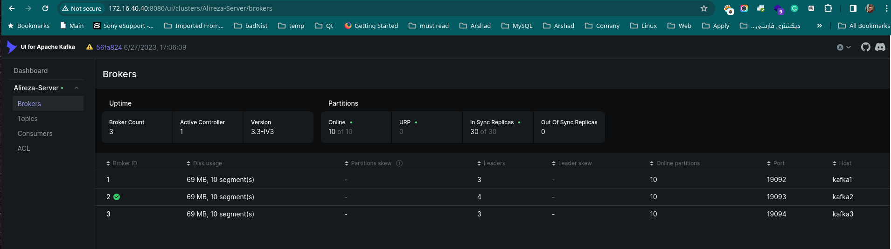
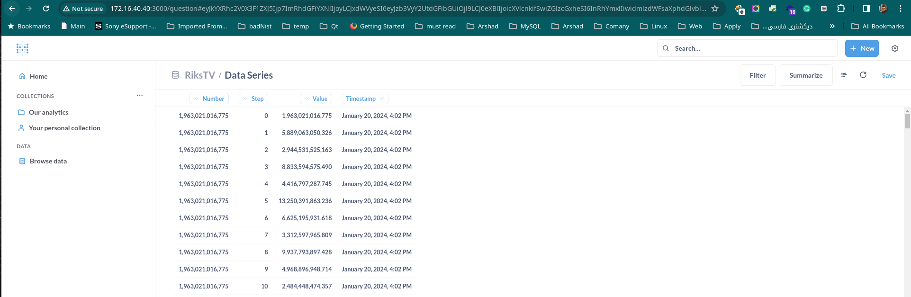
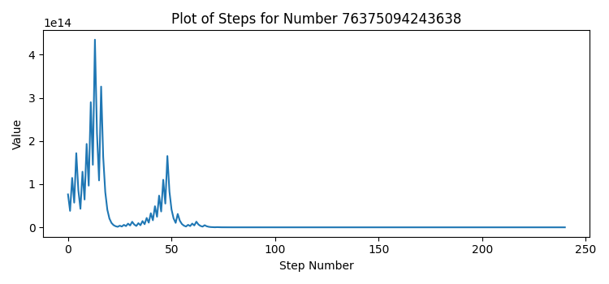
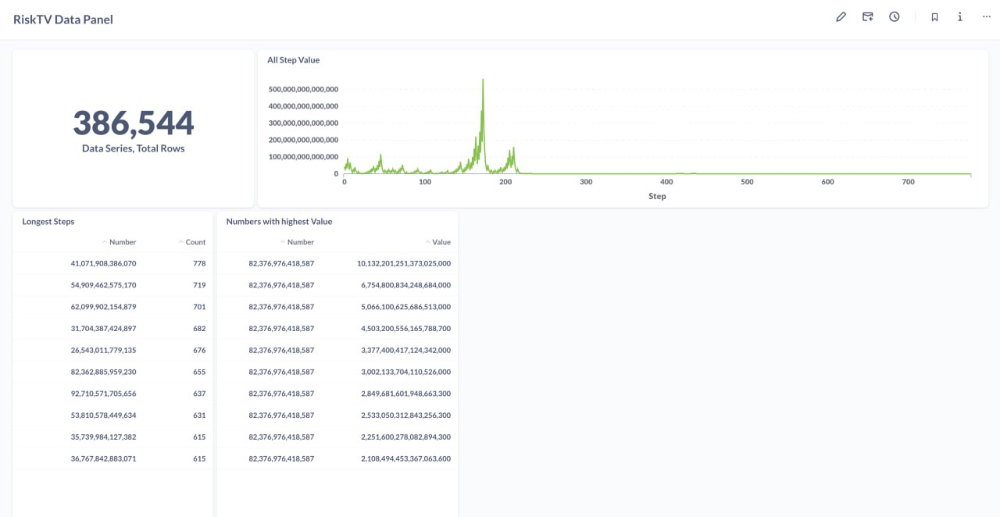
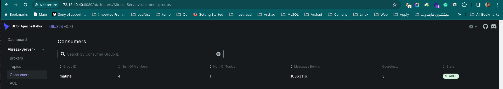

RiksTV interview
================
# Outline
- [Architecture](#architecture)
    - [Detail:](#detail)
- [Installation methods](#installation-methods)
    - [First build Docker images with running script:](#first-build-docker-images-with-running-script)
    - [Second change running Env](#second-change-running-env)
    - [3rd Run stack with Docker compose](#3rd-run-stack-with-docker-compose)
    - [4th - can check web application Swagger](#4th---can-check-web-application-swagger)
    - [5th - can see kafka status](#5th---can-see-kafka-status)
    - [6th - Analytics Dashboard](#6th---analytics-dashboard)
- [Answering the Questions](#answering-the-questions)
    - [1st - Which number had the longest step chain](#1st---which-number-had-the-longest-step-chain)
    - [2nd -  Which number went to the highest value](#2nd---which-number-went-to-the-highest-value)
    - [3rd - is number x part of the step chain of another number.](#3rd---is-number-x-part-of-the-step-chain-of-another-number)
    - [4th - Create a plot of all steps of number](#4th---create-a-plot-of-all-steps-of-number)
    - [Dashboard](#dashboard)
- [Scale project](#scale-project)
- [Create topic or Scale topic partition](#create-topic-or-scale-topic-partition)
- [Terraform](#terraform-file)
- [SQL Schema](#sql-schema-for-clickhouse)
- [Server Spec](#server-spec)
## Architecture

This is picture of project architecture.


### Detail:

* We have 3 node [zookeeper](https://zookeeper.apache.org/) cluster
* We have 3 node [Kafka](https://kafka.apache.org/) broker
* We use [Clickhouse](https://clickhouse.com/) as a big-data database
* For analytics dashboard using [Metabase](https://www.metabase.com/)
* Metabase needs a database to store service users, queries, and dashboards and we use [PostgreSQL](https://www.postgresql.org/) as a database
* For monitoring the Kafka cluster use [Kafka-UI](https://github.com/provectus/kafka-ui)
* Develop producer with python
* Develop consumer with python
* Develop a web application that has REST API to answer the questions with Python [FastAPI](https://fastapi.tiangolo.com/)

## Installation methods

For working with this repository we need [install Docker](https://docs.docker.com/engine/install/) and [Docker Compose](https://docs.docker.com/compose/install/)

You can install project in different ways:

### First build Docker images with running script:

Clone project

```bash
 git clone https://github.com/alirezabe/rikstv-interview .
```

Set permition

```bash
chmod +x ./build-all.sh
```

Run build script

```bash
./build-all.sh
```

After that we have 3 images.

you can see them with:

```bash
docker images
```

The result should be like:

`

```
REPOSITORY                                 TAG              IMAGE ID       CREATED         SIZE
app                                        latest           115e340f0141   5 hours ago     388MB
producer                                   latest           de61f05ff6ca   5 hours ago     218MB
consumer                                   latest           5accf2becc67   5 hours ago     218MB

````

### Second change running Env

Go to [infra](./infra) Directory and check two env files:

* [app env](./infra/.env_app) file
* [kafka env](./infra/.env_kafka) file

In [.env_app](./infra/.env_app) file we have this keys:

```ini
CLICKHOUSE_HOST=clickhouse-server
CLICKHOUSE_PORT=8123
CLICKHOUSE_USER=default
CLICKHOUSE_PASSWORD=
CLICKHOUSE_DB=rikstv
CLICKHOUSE_TABLE=data_series
```


| Environment Name   | Description                                                                                                                     | Defualt value     |
| ------------------- | ------------------------------------------------------------------------------------------------------------------------------- | ----------------- |
| CLICKHOUSE_HOST     | we setup all service in single docker network so we can address them with service_name if setup it in bare system use IP insted | clickhouse-server |
| CLICKHOUSE_PORT     | port of clickhost                                                                                                               | 8123              |
| CLICKHOUSE_USER     | clickhost username                                                                                                              | default           |
| CLICKHOUSE_PASSWORD | default password is null                                                                                                        | NULL              |
| CLICKHOUSE_DB       | costume database name                                                                                                           | rikstv            |
| CLICKHOUSE_TABLE    | costume table name                                                                                                              | data_series       |

In [.env_kafka](./infra/.env_kafka) file we have this keys:

```ini
KAFKA_TOPIC_NAME=conjecture.data
KAFKA_GROUP_ID=matine
VAULT_TOKEN='TOKEN'
VAULT_PATH='["producers"]'
PARTITIONS=4
REPLICATION_FACTOR=3
BOOTSTRAP_SERVERS=kafka1:9092,kafka2:9093,kafka:9094
CLICKHOUSE_HOST=clickhouse-server
CLICKHOUSE_PORT=8123
CLICKHOUSE_USER=default
CLICKHOUSE_PASSWORD=
CLICKHOUSE_DB=rikstv
CLICKHOUSE_TABLE=data_series
```

| Environment Name     | Description                                                                                                                       | Default value                       |
|----------------------|-----------------------------------------------------------------------------------------------------------------------------------|-------------------------------------|
| KAFKA_TOPIC_NAME     | Kafka topic name                                                                                                                  | conjecture.data                     |
| KAFKA_GROUP_ID       | Producer group id                                                                                                                 | matine                              |
| VAULT_TOKEN          | Vault token (not use in example)                                                                                                  | TOKEN                               |
| VAULT_PATH           | Vault paths that service can find secrets value (not use in example)                                                              | ["producers"]                       |
| PARTITIONS           | Number of kafka topic partitions                                                                                                  | 4                                   |
| REPLICATION_FACTOR   | Number of replication of Topic in Brokers                                                                                         | 3                                   |
| BOOTSTRAP_SERVERS    | List of all brokers                                                                                                               | kafka1:9092,kafka2:9093,kafka:9094  |
| CLICKHOUSE_HOST      | we setup all service in single docker network so we can address them with service_name if setup it in bare system use IP instead  | clickhouse-server                   |
| CLICKHOUSE_PORT      | port of Clickhost                                                                                                                 | 8123                                |
| CLICKHOUSE_USER      | Clickhost username                                                                                                                | default                             |
| CLICKHOUSE_PASSWORD  | default password is null                                                                                                          | NULL                                |
| CLICKHOUSE_DB        | costume database name                                                                                                             | rikstv                              |
| CLICKHOUSE_TABLE     | costume table name                                                                                                                | data_series                         |

### 3rd Run stack with Docker compose

Go to [infra](./infra) directory and run [docker-compose](./infra/docker-compose.yml) file

```bash
docker-compose up -d
```

After download in running containers we can get running containers with following command
```shell
docker-compose ps
```
The result should be like this:
```
      Name                     Command                  State                                                    Ports                                              
--------------------------------------------------------------------------------------------------------------------------------------------------------------------
clickhouse-server   /entrypoint.sh                   Up             0.0.0.0:18123->8123/tcp,:::18123->8123/tcp, 0.0.0.0:19000->9000/tcp,:::19000->9000/tcp, 9009/tcp
infra_app_1         uvicorn main:app --host 0. ...   Up             0.0.0.0:8000->80/tcp,:::8000->80/tcp                                                            
infra_consumer_1    python3 consumer.py              Up                                                                                                         
infra_producer_1    python3 producer.py              Up                                                                                                             
kafka-ui            /bin/sh -c java --add-open ...   Up             0.0.0.0:8080->8080/tcp,:::8080->8080/tcp                                                        
kafka1              /etc/confluent/docker/run        Up             0.0.0.0:29092->29092/tcp,:::29092->29092/tcp, 0.0.0.0:9092->9092/tcp,:::9092->9092/tcp          
kafka2              /etc/confluent/docker/run        Up             0.0.0.0:29093->29093/tcp,:::29093->29093/tcp, 9092/tcp, 0.0.0.0:9093->9093/tcp,:::9093->9093/tcp
kafka3              /etc/confluent/docker/run        Up             0.0.0.0:29094->29094/tcp,:::29094->29094/tcp, 9092/tcp, 0.0.0.0:9094->9094/tcp,:::9094->9094/tcp
metabase            /app/run_metabase.sh             Up (healthy)   0.0.0.0:3000->3000/tcp,:::3000->3000/tcp                                                        
postgres            docker-entrypoint.sh postgres    Up             5432/tcp                                                                                        
zoo1                /etc/confluent/docker/run        Up             0.0.0.0:2181->2181/tcp,:::2181->2181/tcp, 2888/tcp, 3888/tcp                                    
zoo2                /etc/confluent/docker/run        Up             2181/tcp, 0.0.0.0:2182->2182/tcp,:::2182->2182/tcp, 2888/tcp, 3888/tcp                          
zoo3                /etc/confluent/docker/run        Up             2181/tcp, 0.0.0.0:2183->2183/tcp,:::2183->2183/tcp, 2888/tcp, 3888/tcp         
```

### 4th - can check web application Swagger
Now you can see swagger in expose port 8000.
In this example we can see swagger in this address ``http://127.0.0.1:8000/docs#/``


### 5th - can see kafka status
Now we can see kafka cluster status in this address ``http://127.0.0.1:8080/ui``


### 6th - Analytics Dashboard
We Use metabase as Analytics Dashboard in this address ``http://127.0.0.1:3000``


## Answering the Questions
For answering question we can use both swagger or call raw API call

### 1st - Which number had the longest step chain

```bash
curl -X 'GET' \
  'http://172.16.40.40:8000/longest_step_chain' \
  -H 'accept: application/json'
```
The answer is:
```json
{
  "longest": 31917434126612
}
```

### 2nd -  Which number went to the highest value
```shell
curl -X 'GET' \
  'http://172.16.40.40:8000/highest_value' \
  -H 'accept: application/json'
```
The answer is:
```json
{
  "longest": 77293533689575
}
```

### 3rd - is number x part of the step chain of another number.
In this example x = 1024
```shell
curl -X 'GET' \
  'http://172.16.40.40:8000/part/1024' \
  -H 'accept: application/json'
```
The answer is:
```json
[
  [
    2361437172277
  ],
  [
    29009624858921
  ],
  [
    35246528388678
  ],
  [
    44108625874832
  ],
  [
    55806168045825
  ],
  [
    58834351055852
  ],
  [
    67949987565981
  ],
  [
    76279233209058
  ],
  [
    76375094243638
  ]
]
```

### 4th - Create a plot of all steps of number
```shell
curl -X 'GET' \
  'http://172.16.40.40:8000/plot/76375094243638' \
  -H 'accept: application/json'
```


### Dashboard
There is a dashboard in Metabase for above questions


## Scale project
For scale producer can use this command:
```shell
docker-compose up -d --scale producer=3
```

For scale consumer can use this command:
```shell
docker-compose up -d --scale consumer=4
```
and now can see the result in Kafka-UI


## Create topic or Scale topic partition
For creating new topic can use this command
```shell
docker exec kafka1 kafka-topics --create --topic alireza.test --bootstrap-server kafka1:9092
```

For scale topic partition use this command
```shell
docker exec kafka1 kafka-topics --alter --topic alireza.test --bootstrap-server kafka1:9092 --partitions 40
```

# Terraform file
we have for [Terraform](https://www.terraform.io/) files for setup cluster with Docker
* [providers.tf](./infra/terraform/providers.tf) for Providers than need to deploy
* [images.tf](./infra/terraform/images.tf) for Docker Image resources
* [containers.tf](./infra/terraform/containers.tf) for Docker containers
* [values.tf](./infra/terraform/volumes.tf) for Docker values

After build all images with [build-all.sh](build-all.sh) script run this command to run cluster.

```shell
terraform init
terraform plan -out rikstv.tfplan
terraform apply
```

# Sql Schema for clickhouse
I use a flat schema for storing data in clickhouse because [MergeTree](https://clickhouse.com/docs/en/engines/table-engines/mergetree-family/mergetree) in clickhouse has great performance for aggregation queries
```sql
CREATE TABLE IF NOT EXISTS TABLE_NAME 
(
        number UInt64,
        step UInt64,
        value UInt64,
        timestamp DateTime
)
```

# Server Spec
The minimum Server spec for run this stack is:

| Resource | Quantity |
|----------|----------|
| Process  | 8 vCore  |
| Memory   | 12 GB    |
| Storage  | 50 GB    |

